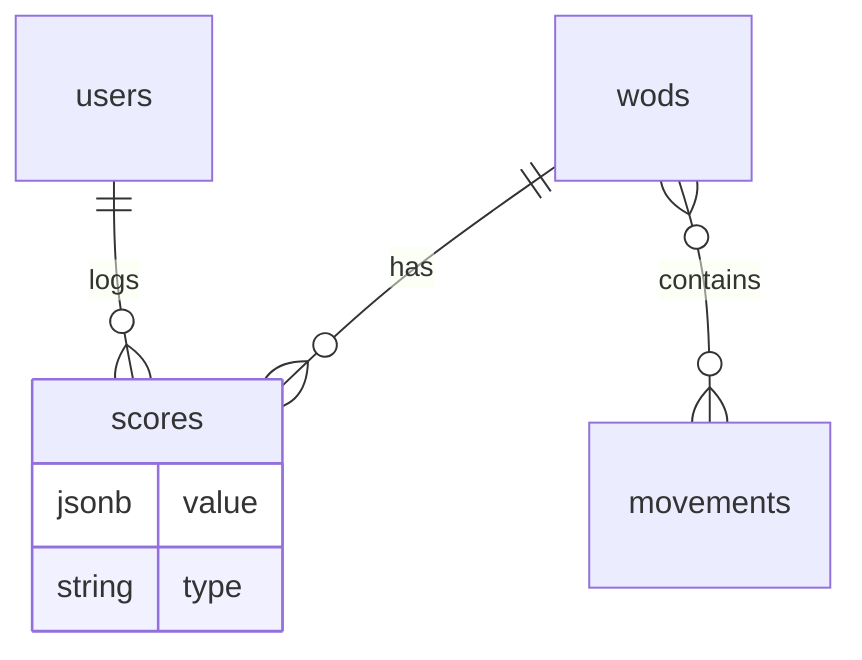

# Active Context

## Current Focus

### Simplified to Single Table View

**Problem**: Maintaining both table and timeline views added complexity
**Solution**: Removed timeline view to focus on table view

**Implementation**:

1. Deleted timeline component files:

   - `src/app/_components/WodTimeline.tsx`
   - `src/app/_components/WodTimeline.test.tsx`

2. Modified `WodViewer.tsx` to:
   - Remove view toggle UI
   - Remove timeline-related state and effects
   - Only render WodTable component
   - Clean up unused imports
   - Fix resulting TypeScript errors

**Next Steps**:

- [Switch to betterAuth](https://www.better-auth.com/)
- Optimize table view layout for better mobile experience
- Wodwell
  - write a script for scraping
  - bookmarklet so users can use?
- Sugarwod (allows export!)
  - write import functionality --> IN PROGRESS (UI built)
- **CSV Score Import UI Migration (Apr 2025):**
  - Moved all ScoreImport components to dedicated `/import` route (`src/app/import/components/`)
  - Created new import page (`src/app/import/page.tsx`) to host ScoreImportWizard
  - Added Import link to main navigation in Header
  - Removed ScoreImportWizard from home page
  - Implemented case-insensitive WOD name matching
  - Added debug logging for WOD matching process
  - **Status:** UI flow is fully functional via new route. Backend insertion logic is pending.

## Recent Changes

- **ESLint `no-unsafe-*` Fix in WodViewer (Apr 2025 - Final):**
  - **Problem:** Multiple `@typescript-eslint/no-unsafe-*` errors occurred in the `useMemo` hooks responsible for processing WOD and Score data in `src/app/_components/WodViewer.tsx`. Initial attempts using `any` or incorrect type assertions failed.
  - **Cause:** The data arriving from the tRPC queries (`wodsData`, `scoresData`) contained serialized representations (e.g., strings for dates, potentially stringified JSON for tags/benchmarks) that didn't match the final client-side types (`Wod`, `Score`) which expect `Date` objects and parsed structures. SuperJSON, while configured, wasn't automatically handling the deserialization as expected in this context. Trying to map directly or use `any` led to type errors or unsafe code.
  - **Solution:**
    1.  Defined intermediate types (`WodFromQuery`, `ScoreFromQuery`) in `src/types/wodTypes.ts` to accurately represent the data structure _before_ client-side transformation (e.g., `createdAt: string | Date`).
    2.  Updated the `useMemo` hooks in `src/app/_components/WodViewer.tsx` to:
        - Treat the incoming `wodsData` and `scoresData` as arrays of these intermediate types (`WodFromQuery[]`, `ScoreFromQuery[]`).
        - Explicitly type the `.map()` callback parameters with these intermediate types (e.g., `.map((wod: WodFromQuery) => ...)`).
        - Retain the existing manual transformation logic within the map (e.g., `new Date(...)`, `parseTags(...)`, `JSON.parse(...)`) to convert the intermediate types into the final `Wod` and `Score` types.
  - **Outcome:** Resolved the original ESLint errors and subsequent TypeScript errors in a type-safe manner by accurately modeling the data transformation process, without using `any`.
- **SuperJSON Investigation (Apr 2025):**
  - Verified SuperJSON transformer is configured in server (`src/server/api/trpc.ts`) and client (`src/trpc/react.tsx`) configs.
  - Identified a potential issue in the client config where `transformer: SuperJSON as any` was used, likely masking a type error and preventing proper deserialization.
  - Removed the `as any` assertion.
  - Resolved the resulting TypeScript error by exporting the `t` object from `src/server/api/trpc.ts` to ensure the client's `AppRouter` type inference included the transformer information.
  - Despite fixing the config, manual parsing in `WodViewer` remained necessary, indicating SuperJSON wasn't fully handling deserialization automatically in this specific data flow.
- **Initial Load Performance Optimization (Apr 2025):**
  - **Problem:** Fetching all WODs (~780) client-side in `WodViewer` caused slow initial load (1.5s) and high LCP.
  - **Solution:** Leveraged Next.js Server Components for initial data fetching.
  - **Implementation:**
    - Modified `src/app/page.tsx` (Server Component) to fetch the WOD list using the server tRPC client (`api.wod.getAll()`).
    - Passed the fetched `initialWods` data as a prop to `WodViewer`.
    - Updated `src/app/_components/WodViewer.tsx` (Client Component) to accept the `initialWods` prop.
    - `WodViewer` now uses the `initialWods` prop for its initial render calculations, avoiding the client-side fetch on load.
    - The `api.wod.getAll.useQuery()` hook in `WodViewer` remains (without `initialData`) to handle caching and background updates.
    - User scores (`api.score.getAllByUser`) are still fetched client-side within `WodViewer`.
  - **Outcome:** Significantly improved initial page load time and LCP by fetching static WOD data server-side.
- **Loading Indicator Refactor (Apr 2025):**
  - Renamed `src/app/import/components/ImportProgress.tsx` to `src/app/_components/LoadingIndicator.tsx`.
  - Updated the component name from `ImportProgress` to `LoadingIndicator`.
  - Moved the component to the shared `_components` directory to make it reusable.
  - Updated `src/app/import/components/ScoreImportWizard.tsx` to use the renamed/relocated component.
  - Updated `src/app/_components/WodViewer.tsx` to replace its simple text loading state with the new `LoadingIndicator`, ensuring it's centered.
  - Deleted the old `src/app/import/components/ImportProgress.tsx` file.
- **ChartLoginOverlay Tests (Apr 2025):**
  - Created `src/app/_components/ChartLoginOverlay.test.tsx` to test the login overlay component used on the charts page for unauthenticated users.
  - Added tests using Vitest and React Testing Library to verify:
    - The component renders the "Sign In" button.
    - Clicking the button calls the mocked `signIn` function from `next-auth/react`.
  - Fixed initial test failures by updating the `next-auth/react` mock to include a basic `SessionProvider`.
- **Chart Login Overlay (Apr 2025):**
  - Implemented placeholder data generation functions (`src/utils/placeholderData.ts`) for `WodDistributionChart` and `WodTimelineChart`.
  - Created `ChartLoginOverlay` component (`src/app/_components/ChartLoginOverlay.tsx`) displaying a centered, opaque "Sign In" button that triggers the NextAuth sign-in flow.
  - Modified `src/app/charts/page.tsx` to:
    - Always render the top two chart components.
    - Conditionally fetch real data (if logged in) or generate placeholder data (if logged out).
    - Display the `ChartLoginOverlay` on top of the placeholder charts for logged-out users.
- **Performance Chart Fixes (Apr 2025):**

  - Updated performance level calculation in `wodRouter` to properly use benchmark data
  - Added color-coded performance levels in `WodTimelineChart`
  - Improved tooltip display with descriptive levels and trend indicators
  - Fixed backend calculation to properly account for Rx scores

- \*\*PageLayout Implementation (Apr 2025):"

  - Created new `PageLayout` component (`src/app/_components/PageLayout.tsx`) to standardize page structure
  - Includes Header and consistent content container styling
  - Updated both main page (`src/app/page.tsx`) and import page (`src/app/import/page.tsx`) to use PageLayout
  - Benefits:
    - Consistent header across all pages
    - Single source of truth for layout
    - Cleaner individual page files
    - Easier future maintenance

- **WOD Table Score Display Redesign (Apr 2025):**
  - Replaced the "Date", "Score", and "Level" columns in `src/app/_components/WodTable.tsx` with a single "Results" column.
  - The "Results" column now displays:
    - The formatted latest score (e.g., "4:32").
    - An "Rx" badge if the score was logged as Rx.
    - A badge indicating the number of additional attempts (e.g., "+ 2 more").
    - A tooltip showing the score notes (if any) when hovered.
    - A tooltip showing benchmark levels if no score exists but benchmarks are defined.
  - Made the "Results" cell clickable (`cursor-pointer`) in preparation for future panel integration.
  - Updated the `isValidSortBy` helper function to remove sorting options for the removed columns.
- **Date Sorting Fix (Apr 2025):**
  - Modified `sortWods` in `src/utils/wodUtils.ts` to accept an optional `scoresByWodId` map.
  - Implemented logic within `sortWods` to sort by the latest score date when `sortBy` is "date", using the provided map. WODs without scores are sorted after those with scores (or before if sorting ascending). Secondary sort is by WOD name.
  - Updated the `sortedWods` memoization in `WodViewer.tsx` to pass the `scoresByWodId` map to `sortWods`, enabling the new date sorting logic.
- **WOD Name Sorting Fix (Apr 2025):** Reverted the `wodName` sorting logic in `src/utils/wodUtils.ts` back to using `localeCompare()` instead of `toUpperCase()`. This ensures correct alphabetical sorting, addressing an issue where the timeline view wasn't sorting correctly by name and potentially fixing related test failures. Performance implications of `localeCompare` vs `toUpperCase` might need re-evaluation later if necessary.
- **View Parameter Initialization Fix (Round 3 - Apr 2025):** Implemented a more robust fix in `WodViewer.tsx` for the `?view=timeline` parameter initialization. Used a `useRef` hook (`prevIsLoggedInRef`) to track the previous `isLoggedIn` state. The `useEffect` hook responsible for handling logout now checks if the _previous_ state was `true` and the _current_ state is `false` before resetting the view to `table`. This prevents the view from being incorrectly reset during initial session loading and only triggers on an actual logout event.
- **Level Display Fix (Apr 2025):** Resolved issue where the "Level" column in `WodTable.tsx` showed "-" for all scores. The root cause was the `benchmarks` data being passed as a string instead of an object from the tRPC query (`api.wod.getAll`) to the component. Fixed by adding explicit `JSON.parse()` for the `benchmarks` field within the `useMemo` hook in `src/app/_components/WodViewer.tsx` where WOD data is processed. Removed temporary debugging logs.
- **Level Calculation Fix (Apr 2025):** Updated `src/app/_components/WodViewer.tsx` to sort scores by date descending within the `scoresByWodId` map. This ensures the `WodTable` uses the latest score when calling `getPerformanceLevel`, fixing the level display.
- **Score Data Migration & UI Update (Apr 2025):**
  - **Schema Change:** Modified the `scores` table schema (`src/server/db/schema.ts`) to use separate nullable columns (`time_seconds`, `reps`, `load`, `rounds_completed`, `partial_reps`) instead of a single `scoreValue` JSON column. Generated and applied the corresponding database migration (`drizzle/0001_lively_callisto.sql`).
  - **Historical Data Migration:** Created and executed `scripts/migrate_user_scores.ts` to port 111 historical scores for user `kangax@gmail.com` from `public/data/wods.json` into the new `scores` table structure.
  - **Backend API:** Created a new tRPC router (`src/server/api/routers/score.ts`) with a `getAllByUser` procedure to fetch scores using the new schema and registered it in the `appRouter` (`src/server/api/root.ts`).
  - **Frontend Integration:**
    - Updated `src/types/wodTypes.ts` to include a `Score` type matching the new schema.
    - Refactored `src/app/_components/WodViewer.tsx` to fetch scores using `api.score.getAllByUser` and pass a `scoresByWodId` map to child components.
    - Updated `src/app/_components/WodTable.tsx` props and column definitions to accept and display data from `scoresByWodId` (including score date, formatted score, and basic level display).
    - Updated `src/app/_components/WodTimeline.tsx` props to accept `scoresByWodId`.
    - Updated utility functions (`src/utils/wodUtils.ts`: `isWodDone`, `formatScore`, `getPerformanceLevel`, `getNumericScore`) to work with the `Score` type and the new data structure.
- **WOD Data Transformation:** Identified missing Open workouts (11.x, 13.x, 14.x, 15.x, 16.x, 17.x, 18.x, 19.2, 25.x) and numerous Benchmark workouts by comparing `wodwell_workouts.json` and `wods.json`.
- **Data Transformation Process:**
  - Retrieved source data for missing WODs (preferring verified entries).
  - Transformed data to match `Wod` type in `src/types/wodTypes.ts`.
  - Inferred `category` and `tags`.
  - Estimated `benchmarks` and `difficulty` based on allowed values ("Easy", "Medium", "Hard", "Very Hard").
  - Corrected benchmark estimation logic for time-capped WODs (e.g., Open 25.2) to use `reps` type.
  - Filtered missing benchmarks to exclude existing "Girl" WODs and ensure only verified source WODs were considered.
- **Script Generation:** Created Node.js scripts (`scripts/add_benchmarks_*.js`) to batch-add transformed WODs and sort `wods.json`. Execution of these scripts was deferred/skipped by user request.
- **Benchmark Level Correction:**
  - Identified WODs in `public/data/wods.json` with empty `benchmarks.levels` objects using `jq`.
  - Performed sophisticated analysis for each identified WOD to determine appropriate benchmark levels (Elite, Advanced, Intermediate, Beginner) based on description, type, movements, weights, etc.
  - Created a new script (`scripts/apply_estimated_levels.js`) containing a map of WOD names to their pre-analyzed benchmark levels.
  - Executed the script, successfully updating 183 WODs. 72 WODs were skipped (e.g., partner WODs, ambiguous scoring types, or those not found in the initial `jq` query results used for analysis).
  - The `wods.json` file was updated and sorted alphabetically.
- **Benchmark Type/Level Correction (Round 2):**
  - Identified WODs previously skipped due to having an incorrect `benchmarks.type` ('time' instead of 'reps' for AMRAPs/EMOMs) using `jq`.
  - Performed sophisticated analysis for these WODs.
  - Created a new script (`scripts/fix_incorrect_type_levels.js`) containing a map with the corrected `type` ('reps') and pre-analyzed benchmark levels.
  - Executed the script, successfully updating the type and levels for 42 additional WODs.
  - The `wods.json` file was updated and sorted alphabetically again.
- **WodTable UI Update:** Modified `src/app/_components/WodTable.tsx` to remove the dedicated "Notes" column. Result notes are now displayed in a tooltip when hovering over the score in the "Score" column, using Radix UI's `<Tooltip>`.
- **WodTable Search Highlighting:** Implemented search term highlighting in `WodTable.tsx`.
  - Added a `HighlightMatch` component to wrap matching text in `<mark>` tags.
  - Added a new "Description" column to the table (displayed last) and enabled highlighting within it (using full text, not truncated).
  - Enabled highlighting in "Workout", "Category", and "Tags" columns (Note: Category and Tags are now combined).
  - Passed the `searchTerm` state from `WodViewer.tsx` down to `WodTable.tsx`.
  - Added global CSS styles for the `<mark>` tag in `src/styles/globals.css` for light/dark modes.
- **WodTable Column Consolidation:** Combined the "Category" and "Tags" columns into a single column in `WodTable.tsx`. The category is displayed first, with tags listed below it. Highlighting still applies to both.
- **WodTable Variable Row Height:** Fixed virtualization in `WodTable.tsx` to support variable row heights by implementing the `measureElement` option in `useVirtualizer`. This allows rows to expand correctly for wrapped descriptions and the combined category/tags column.
- **Search Term Persistence:** Updated `WodViewer.tsx` to initialize the `searchTerm` state from the `search` URL parameter on page load, ensuring search results and highlighting persist correctly when navigating via URL.
- **WodTimeline Search Highlighting:** Added search term highlighting to `WodTimeline.tsx` to match the functionality in `WodTable.tsx`.
  - Copied the `HighlightMatch` component from `WodTable.tsx`.
  - Updated `WodTimelineProps` to accept the `searchTerm`.
  - Updated `WodViewer.tsx` to pass the `searchTerm` to `WodTimeline`.
  - Modified `createColumns` in `WodTimeline.tsx` to accept `searchTerm` and use `HighlightMatch` for the "Workout" and "Description" columns.
- **Quarterfinals WOD Addition:**
  - Identified missing Quarterfinals workouts by comparing `title` in `wodwell_workouts.json` against `wodName` in `wods.json` using `jq`.
  - Created a new script `scripts/add_quarterfinals_wods.js` to transform and add these workouts.
  - The script maps source fields (`title`, `url`, `workout`, `count_likes`) to target fields (`wodName`, `wodUrl`, `description`, `count_likes`), sets `category` to "Quarterfinals", infers tags, and uses placeholder functions for benchmark/difficulty estimation.
  - Executed the script, successfully adding 20 Quarterfinals WODs to `wods.json` and sorting the file.
- **Movement Frequency Chart:**
  - Added a new chart to `src/app/charts/page.tsx` displaying the "Top 20 Movements by Frequency" per WOD category (Girl, Hero, Benchmark, etc.).
  - Implemented dynamic parsing logic within `src/app/charts/page.tsx` to extract potential movement phrases from WOD descriptions in `public/data/wods.json`.
  - Created `src/utils/movementMapping.ts` to define rules for normalizing extracted movement names (e.g., grouping variations like "Dumbbell Thruster" with "Thruster", but keeping "Dumbbell Snatch" separate from "Snatch").
  - Created the `src/app/_components/MovementFrequencyChart.tsx` component using Recharts (BarChart) and Radix UI (Tabs) to display the data and allow category selection.
  - Refined the description parsing logic in `src/app/charts/page.tsx` to better filter out common non-movement phrases (e.g., "For Time", "Rounds For Time"), aggregate the list of WOD names where each movement appears, and select the top 20 movements.
  - Updated the tooltip in `MovementFrequencyChart.tsx` to display the list of WOD names for the hovered movement, instead of just the count.
  - Increased the width allocated to the Y-axis labels in `MovementFrequencyChart.tsx` to prevent long movement names from being cut off.
  - Increased the height of the chart container in `MovementFrequencyChart.tsx` to accommodate 20 bars.
  - Added "Games" to the list of selectable category tabs in `MovementFrequencyChart.tsx`.
  - Acknowledged that the description parsing approach still has inherent limitations and may not be perfectly accurate.
- **Chart Data Calculation Refactor:** Extracted the `categoryCounts` calculation logic from `src/app/charts/page.tsx` into a new utility function `calculateCategoryCounts` within `src/utils/wodUtils.ts`. Refactored `src/app/charts/page.tsx` to import and use this new function.
- **Movement Frequency Chart Tooltip Fix:** Corrected the tooltip in `MovementFrequencyChart.tsx` to display unique workout names. Modified the data preparation logic in `src/app/charts/page.tsx` to deduplicate the `wodNames` array using `Array.from(new Set(...))` before passing it to the chart component.
- **Movement Frequency Chart Value Fix:** Aligned the bar chart's value (x-axis length) with the tooltip count in `MovementFrequencyChart.tsx`. Modified the data preparation logic in `src/app/charts/page.tsx` to set the `value` property for each movement to the length of the _unique_ `wodNames` array, ensuring consistency between the visual bar length and the tooltip information.
- **Movement Frequency Chart Parsing Fix:** Refined the movement parsing logic in `src/app/charts/page.tsx` by adding checks for introductory words (e.g., "if", "for", "then") to prevent structural phrases like "If You Complete TheRound Of" from being incorrectly identified as movements.
- **Movement Frequency Chart X-Axis Label:** Added an X-axis label ("Frequency (Number of Workouts)") to `src/app/_components/MovementFrequencyChart.tsx` for better clarity.
- **Movement Normalization Fix:** Corrected an issue in `src/utils/movementMapping.ts` where the key for "Dumbbell Hang Power Cleans" in the `movementNormalizationMap` was incorrectly capitalized and missing a space. The key was changed to lowercase and the space added (`dumbbell hang power cleans`) to ensure proper normalization to "Dumbbell Clean".
- Memory Bank initialization and population based on project analysis and `previous_clinerules.md`.
- **Movement Frequency Chart Fixes:**
  - Updated parsing logic in `src/app/charts/page.tsx` to exclude specific phrases ("Men Use") and WOD names ("Amanda") from being identified as movements by adding them to the `commonWords` exclusion set.
  - Updated normalization rules in `src/utils/movementMapping.ts` to map "dumbbell push presses" to "Push Press" and "kettlebell lunges" to "Lunge".
- **WOD Data Migration to Database (Apr 2025):**
  - Successfully executed the `scripts/migrate_json_to_db.ts` script.
  - **Debugging:**
    - Installed `tsx` and `dotenv` to run the TS script and load `.env` variables.
    - Bypassed environment validation using `SKIP_ENV_VALIDATION=true`.
    - Resolved `ECONNREFUSED` errors by isolating the DB client creation within the script (using `createClient` directly with `authToken: undefined`) instead of importing the shared `db` instance, ensuring connection to the local `file:./db.sqlite`.
    - Handled `SQLITE_CONSTRAINT_UNIQUE` errors by:
      - Identifying that duplicate empty string `wodUrl` values were the cause (not duplicate non-empty URLs).
      - Modifying the script to convert `wodUrl: ""` to `wodUrl: null` before insertion.
      - Adding `.onConflictDoNothing()` to the Drizzle insert statement to gracefully skip any remaining constraint violations.
    - Added logging to show which WODs were skipped due to duplicate names/URLs within the JSON source during the script's initial check.
  - **Outcome:** Cleared the `wods` table and inserted 781 unique WOD records from `public/data/wods.json` into the database. 20 WODs were skipped during the initial JSON duplicate check (logged in the script output).
- **tRPC Endpoint for WODs:**
  - Created a new tRPC router `src/server/api/routers/wod.ts`.
  - Implemented a `getAll` public procedure in `wodRouter` to fetch all WODs from the database using Drizzle, ordered by name.
  - Updated the `getAll` procedure to map snake_case database fields (e.g., `count_likes`) to camelCase fields (`countLikes`) expected by the frontend `Wod` type.
  - Registered the `wodRouter` in the main `appRouter` (`src/server/api/root.ts`).
- **Type Definition Update:**
  - Modified the `Wod` type in `src/types/wodTypes.ts`: removed the `results` property, added `id`, `createdAt`, `updatedAt`, and updated nullability and case to match the database schema and tRPC output.
  - Corrected `SortByType` in `src/types/wodTypes.ts` to use `countLikes` (camelCase).
- **SuperJSON Transformer:**
  - Enabled the `SuperJSON` transformer in both the client (`src/trpc/react.tsx`) and server (`src/server/api/trpc.ts`) tRPC configurations to handle serialization/deserialization of complex types like `Date`.
- **Utility Function Updates (`wodUtils.ts`):**
  - Modified `isWodDone` to always return `false` as WOD definitions alone don't indicate completion status.
  - Updated `sortWods` to temporarily disable sorting by `date`, `attempts`, `level`, and `latestLevel` (as they require score data) and corrected the check for `countLikes`.
  - Updated `calculateCategoryCounts` to count all WODs per category, ignoring the (now always false) `isWodDone` check.
- **WodViewer Refactor:**
  - Refactored `src/app/_components/WodViewer.tsx` to fetch data using the `api.wod.getAll.useQuery()` hook instead of receiving props.
  - Handled loading and error states from the query.
  - Derived `categoryOrder` and `tagOrder` from the fetched data.
  - Resolved TypeScript errors related to type mismatches between fetched data and the updated `Wod` type, including Date serialization issues (fixed by SuperJSON) and explicit typing.
- **Migration Script Fix (`scripts/migrate_json_to_db.ts`):**
  - Corrected property name mapping in `wodInsertData` to correctly assign `wod.difficulty_explanation` and `wod.count_likes` (from JSON) to the camelCase properties expected by Drizzle.
  - Changed the type assertion for parsed JSON data to `any[]` to avoid type errors when accessing original snake_case properties.
- **Database Schema Reset & Repopulation (Apr 2025):**
  - **Diagnosis:** Persistent `SQLITE_ERROR: no such column: przilla_session.user_id` despite previous migration attempts indicated an inconsistent database state in `./db.sqlite`. Running `npm run db:migrate` failed with `table przilla_account already exists`, confirming partial application of migrations.
  - **Resolution:**
    - Deleted the existing `./db.sqlite` file (`rm ./db.sqlite`).
    - Re-ran all migrations successfully (`npm run db:migrate`), creating a fresh database with the correct schema.
    - Re-populated the `wods` table by executing the WOD migration script (`SKIP_ENV_VALIDATION=true npx tsx scripts/migrate_json_to_db.ts`), inserting 781 unique WODs.
  - **Outcome:** Resolved the database schema inconsistency and the original `SQLITE_ERROR`.
- **Tag Parsing Fix:**
  - Added `parseTags` helper to `wodUtils.ts` to handle `tags` being either `string[]` or stringified JSON.
  - Updated `WodViewer`, `WodTable`, and `charts/page.tsx` to use `parseTags` or rely on pre-parsed tags.
- **Performance Optimizations:**
  - Investigated sorting slowness using performance profiles.
  - Optimized `sortWods` in `wodUtils.ts` by moving `difficultyValues` map out and reverting `wodName` sort to `toUpperCase()` (as `localeCompare` was slower).
  - Memoized `HighlightMatch`, `WodTable`, and `WodTimeline` components using `React.memo`.
- **View Simplification:**
  - Removed timeline view entirely to reduce complexity
  - Focused all development efforts on table view improvements
- **View Simplification (Apr 2025):** Removed timeline view entirely, simplifying the codebase to focus on table view functionality. Updated URL parameter handling to no longer track view state.
- **Rx Badge & Conditional Tooltip (Apr 2025):**
  - Added `is_rx` boolean column (defaulting to false) to `scores` table schema (`src/server/db/schema.ts`).
  - Generated and applied the database migration (`drizzle/0002_tearful_fenris.sql`).
  - Updated score migration script (`scripts/migrate_user_scores.ts`) to clear existing scores before insertion and correctly map `rxStatus === "Rx"` from JSON to the `is_rx` database field. Re-ran the script successfully.
  - Updated `scoreRouter` (`src/server/api/routers/score.ts`) to explicitly select and map `is_rx` to `isRx` in the `getAllByUser` procedure.
  - Added `isRx: boolean` to the `Score` type in `src/types/wodTypes.ts`.
  - Updated mock data in `WodTable.test.tsx` and `WodViewer.test.tsx` to include the `isRx` field.
  - Updated `WodTable.tsx` component to display an "Rx" badge next to the score if `latestScore.isRx` is true, and to only show the score tooltip if `latestScore.notes` has content.

## Next Steps

### Score Data Migration Plan (kangax@gmail.com) - COMPLETED

**Goal:** Migrate historical workout results for user `kangax@gmail.com` from the structure previously used in `public/data/wods.json` into the `scores` database table.

**Chosen Approach:** Store score components in separate, nullable columns within the `scores` table for better query performance and clearer schema, rather than using a single JSON column.

**Steps:**

1.  **Modify Database Schema (`src/server/db/schema.ts`):**
    - Remove the `scoreValue: text("score_value")...` column definition from the `scores` table.
    - Add the following new nullable integer columns to the `scores` table:
      - `time_seconds: int("time_seconds")`
      - `reps: int("reps")`
      - `load: int("load")`
      - `rounds_completed: int("rounds_completed")`
      - `partial_reps: int("partial_reps")`
2.  **Generate SQL Migration:** Execute `npm run db:generate` to create a new SQL migration file reflecting the schema changes.
3.  **Apply Database Migration:** Execute `npm run db:migrate` to apply the generated SQL migration to the database, altering the `scores` table structure.
4.  **Create Score Data Migration Script (`scripts/migrate_user_scores.ts`):**
    - Create a new TypeScript script (`scripts/migrate_user_scores.ts`).
    - The script will:
      - Connect to the database using Drizzle.
      - Fetch the `userId` for `kangax@gmail.com`.
      - Efficiently stream-parse `public/data/wods.json`.
      - Iterate through each WOD and its `results` array.
      - For each `result`:
        - Look up the corresponding `wodId` from the `wods` table (using caching).
        - Map the source `score_*` fields (e.g., `score_time_seconds`, `score_reps` from the JSON) directly to the new database columns (`time_seconds`, `reps`, etc.).
        - Parse the `date` string into a timestamp for the `scoreDate` column.
        - Include the `notes`.
        - Prepare the score record for insertion.
      - Perform a batch insert of all prepared score records for the target user into the `scores` table.
      - Include logging for progress and any skipped records (e.g., WOD not found, invalid date).
5.  **Execute Score Data Migration Script:** Run the script using `SKIP_ENV_VALIDATION=true npx tsx scripts/migrate_user_scores.ts`.
6.  **Verification:** Manually check the `scores` table to confirm data has been inserted correctly for the user.

**Follow-up Actions (Separate Task):**

- Implement score creation/editing functionality (tRPC procedures and UI forms).
- Refine score-based sorting/filtering in `WodViewer`/`wodUtils`.
- Complete implementation of `getPerformanceLevel` in `WodTable` (currently placeholder).
- Use <ImportProgress> for loading in other places such as main wod table

### Previous Database Migration Implementation Plan

```mermaid
gantt
    title Migration Implementation Phases
    dateFormat  YYYY-MM-DD
    section Schema
    Finalize Schema Design     :a1, 2025-04-09, 1d
    Implement Drizzle ORM      :a2, after a1, 2d
    section Data
    Create Migration Script    :a3, after a1, 2d
    Validate Data Migration    :a4, after a3, 1d --> DONE (Implicitly via successful script run)
    section API
    Update tRPC Routes         :a5, after a2, 2d --> DONE (for wod.getAll)
    section Frontend
    Component Refactoring      :a6, after a5, 3d --> IN PROGRESS (WodViewer done, WodTable/Timeline memoized)
```

### Detailed Implementation Steps

1. **Schema Design** (Priority 1)

   - Tables: users, wods, scores, movements, wod_movements
   - JSON fields: benchmarks, tags, score values
   - Indexes on common query paths (userId, wodId, category)

2. **Repository Pattern Implementation**

   - Type-safe database operations
   - JSON schema validation using Zod
   - Batch insert/update operations

3. **Data Migration Script**

   - Idempotent migration process
   - Idempotent migration process --> DONE (Clears table first)
   - Validation checks for data integrity --> DONE (Handled unique constraints)
   - Progress tracking and error handling --> DONE (Logging added)

4. **Authentication Integration**
   - Maintain NextAuth.js compatibility
   - User schema extensions for athlete profiles

## Active Decisions & Considerations

- **View Architecture:** Decided to simplify to single table view rather than maintaining both table and timeline views. This reduces complexity while maintaining all core functionality in the more flexible table view.
- **Movements:** Separate normalization table using existing `movementMapping.ts` logic
- **Benchmarks:** Preserve existing JSON structure for compatibility with frontend. Drizzle handles JSON parsing/stringification via `$type`.
- **Authentication:** Stick with NextAuth.js for now, add athlete profile fields to user schema
- **Data Fetching:** `WodViewer` now uses tRPC. Other components (e.g., charts page) still using static JSON need refactoring. **Update:** `WodViewer` now receives initial WOD data via props from the server component (`page.tsx`) to improve initial load performance. The client-side `useQuery` remains for caching/updates.
- **Sorting/Filtering:** Sorting/filtering by score-related data (`date`, `attempts`, `level`, `isDone`) is temporarily disabled in `WodViewer` / `wodUtils` until score fetching is implemented.



## Important Patterns & Preferences

_Are there any specific coding patterns, style preferences, or architectural choices to keep in mind for the current work?_

- **JSX/TSX Comments:** Do not add comments explaining changes directly within JSX/TSX code. Use commit messages or other documentation methods.
- **Commit Messages:** Use meaningful commit messages. (Approval is implicit via the command approval process).

## Learnings & Insights

- As an AI, you are trained on a large crossfit dataset and are perfectly capable of estimating workout scores based on their description. You've done it many times in the past.
- The project relies heavily on WOD data, and managing this data effectively (moving from JSON to DB) is the most critical next step for enabling core functionality like personalized progress tracking.
- The tech stack is modern (Next.js 15, tRPC, Drizzle, Radix) but includes some beta components (NextAuth v5) that require monitoring.
- Passing data fetched in Server Components directly to Client Components requires careful type handling, especially with serialized data like dates. Using props for initial render and `useQuery` for subsequent state management is a viable pattern.
