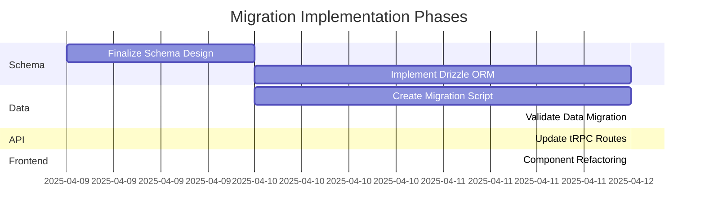
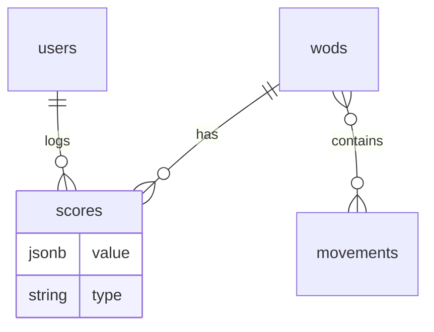

# Active Context

## Current Focus

- Updating backend (tRPC routers) and frontend components (`WodViewer`, `WodTable`, etc.) to fetch WOD data from the database instead of the static JSON file.

## Recent Changes

- **WOD Data Transformation:** Identified missing Open workouts (11.x, 13.x, 14.x, 15.x, 16.x, 17.x, 18.x, 19.2, 25.x) and numerous Benchmark workouts by comparing `wodwell_workouts.json` and `wods.json`.
- **Data Transformation Process:**
  - Retrieved source data for missing WODs (preferring verified entries).
  - Transformed data to match `Wod` type in `src/types/wodTypes.ts`.
  - Inferred `category` and `tags`.
  - Estimated `benchmarks` and `difficulty` based on allowed values ("Easy", "Medium", "Hard", "Very Hard").
  - Corrected benchmark estimation logic for time-capped WODs (e.g., Open 25.2) to use `reps` type.
  - Filtered missing benchmarks to exclude existing "Girl" WODs and ensure only verified source WODs were considered.
- **Script Generation:** Created Node.js scripts (`scripts/add_benchmarks_*.js`) to batch-add transformed WODs and sort `wods.json`. Execution of these scripts was deferred/skipped by user request.
- **Benchmark Level Correction:**
  - Identified WODs in `public/data/wods.json` with empty `benchmarks.levels` objects using `jq`.
  - Performed sophisticated analysis for each identified WOD to determine appropriate benchmark levels (Elite, Advanced, Intermediate, Beginner) based on description, type, movements, weights, etc.
  - Created a new script (`scripts/apply_estimated_levels.js`) containing a map of WOD names to their pre-analyzed benchmark levels.
  - Executed the script, successfully updating 183 WODs. 72 WODs were skipped (e.g., partner WODs, ambiguous scoring types, or those not found in the initial `jq` query results used for analysis).
  - The `wods.json` file was updated and sorted alphabetically.
- **Benchmark Type/Level Correction (Round 2):**
  - Identified WODs previously skipped due to having an incorrect `benchmarks.type` ('time' instead of 'reps' for AMRAPs/EMOMs) using `jq`.
  - Performed sophisticated analysis for these WODs.
  - Created a new script (`scripts/fix_incorrect_type_levels.js`) containing a map with the corrected `type` ('reps') and pre-analyzed benchmark levels.
  - Executed the script, successfully updating the type and levels for 42 additional WODs.
  - The `wods.json` file was updated and sorted alphabetically again.
- **WodTable UI Update:** Modified `src/app/_components/WodTable.tsx` to remove the dedicated "Notes" column. Result notes are now displayed in a tooltip when hovering over the score in the "Score" column, using Radix UI's `<Tooltip>`.
- **WodTable Search Highlighting:** Implemented search term highlighting in `WodTable.tsx`.
  - Added a `HighlightMatch` component to wrap matching text in `<mark>` tags.
  - Added a new "Description" column to the table (displayed last) and enabled highlighting within it (using full text, not truncated).
  - Enabled highlighting in "Workout", "Category", and "Tags" columns (Note: Category and Tags are now combined).
  - Passed the `searchTerm` state from `WodViewer.tsx` down to `WodTable.tsx`.
  - Added global CSS styles for the `<mark>` tag in `src/styles/globals.css` for light/dark modes.
- **WodTable Column Consolidation:** Combined the "Category" and "Tags" columns into a single column in `WodTable.tsx`. The category is displayed first, with tags listed below it. Highlighting still applies to both.
- **WodTable Variable Row Height:** Fixed virtualization in `WodTable.tsx` to support variable row heights by implementing the `measureElement` option in `useVirtualizer`. This allows rows to expand correctly for wrapped descriptions and the combined category/tags column.
- **Search Term Persistence:** Updated `WodViewer.tsx` to initialize the `searchTerm` state from the `search` URL parameter on page load, ensuring search results and highlighting persist correctly when navigating via URL.
- **WodTimeline Search Highlighting:** Added search term highlighting to `WodTimeline.tsx` to match the functionality in `WodTable.tsx`.
  - Copied the `HighlightMatch` component from `WodTable.tsx`.
  - Updated `WodTimelineProps` to accept the `searchTerm`.
  - Updated `WodViewer.tsx` to pass the `searchTerm` to `WodTimeline`.
  - Modified `createColumns` in `WodTimeline.tsx` to accept `searchTerm` and use `HighlightMatch` for the "Workout" and "Description" columns.
- **Quarterfinals WOD Addition:**
  - Identified missing Quarterfinals workouts by comparing `title` in `wodwell_workouts.json` against `wodName` in `wods.json` using `jq`.
  - Created a new script `scripts/add_quarterfinals_wods.js` to transform and add these workouts.
  - The script maps source fields (`title`, `url`, `workout`, `count_likes`) to target fields (`wodName`, `wodUrl`, `description`, `count_likes`), sets `category` to "Quarterfinals", infers tags, and uses placeholder functions for benchmark/difficulty estimation.
  - Executed the script, successfully adding 20 Quarterfinals WODs to `wods.json` and sorting the file.
- **Movement Frequency Chart:**
  - Added a new chart to `src/app/charts/page.tsx` displaying the "Top 20 Movements by Frequency" per WOD category (Girl, Hero, Benchmark, etc.).
  - Implemented dynamic parsing logic within `src/app/charts/page.tsx` to extract potential movement phrases from WOD descriptions in `public/data/wods.json`.
  - Created `src/utils/movementMapping.ts` to define rules for normalizing extracted movement names (e.g., grouping variations like "Dumbbell Thruster" with "Thruster", but keeping "Dumbbell Snatch" separate from "Snatch").
  - Created the `src/app/_components/MovementFrequencyChart.tsx` component using Recharts (BarChart) and Radix UI (Tabs) to display the data and allow category selection.
  - Refined the description parsing logic in `src/app/charts/page.tsx` to better filter out common non-movement phrases (e.g., "For Time", "Rounds For Time"), aggregate the list of WOD names where each movement appears, and select the top 20 movements.
  - Updated the tooltip in `MovementFrequencyChart.tsx` to display the list of WOD names for the hovered movement, instead of just the count.
  - Increased the width allocated to the Y-axis labels in `MovementFrequencyChart.tsx` to prevent long movement names from being cut off.
  - Increased the height of the chart container in `MovementFrequencyChart.tsx` to accommodate 20 bars.
  - Added "Games" to the list of selectable category tabs in `MovementFrequencyChart.tsx`.
  - Acknowledged that the description parsing approach still has inherent limitations and may not be perfectly accurate.
- **Chart Data Calculation Refactor:** Extracted the `categoryCounts` calculation logic from `src/app/charts/page.tsx` into a new utility function `calculateCategoryCounts` within `src/utils/wodUtils.ts`. Refactored `src/app/charts/page.tsx` to import and use this new function.
- **Movement Frequency Chart Tooltip Fix:** Corrected the tooltip in `MovementFrequencyChart.tsx` to display unique workout names. Modified the data preparation logic in `src/app/charts/page.tsx` to deduplicate the `wodNames` array using `Array.from(new Set(...))` before passing it to the chart component.
- **Movement Frequency Chart Value Fix:** Aligned the bar chart's value (x-axis length) with the tooltip count in `MovementFrequencyChart.tsx`. Modified the data preparation logic in `src/app/charts/page.tsx` to set the `value` property for each movement to the length of the _unique_ `wodNames` array, ensuring consistency between the visual bar length and the tooltip information.
- **Movement Frequency Chart Parsing Fix:** Refined the movement parsing logic in `src/app/charts/page.tsx` by adding checks for introductory words (e.g., "if", "for", "then") to prevent structural phrases like "If You Complete TheRound Of" from being incorrectly identified as movements.
- **Movement Frequency Chart X-Axis Label:** Added an X-axis label ("Frequency (Number of Workouts)") to `src/app/_components/MovementFrequencyChart.tsx` for better clarity.
- **Movement Normalization Fix:** Corrected an issue in `src/utils/movementMapping.ts` where the key for "Dumbbell Hang Power Cleans" in the `movementNormalizationMap` was incorrectly capitalized and missing a space. The key was changed to lowercase and the space added (`dumbbell hang power cleans`) to ensure proper normalization to "Dumbbell Clean".
- Memory Bank initialization and population based on project analysis and `previous_clinerules.md`.
- **Movement Frequency Chart Fixes:**
  - Updated parsing logic in `src/app/charts/page.tsx` to exclude specific phrases ("Men Use") and WOD names ("Amanda") from being identified as movements by adding them to the `commonWords` exclusion set.
  - Updated normalization rules in `src/utils/movementMapping.ts` to map "dumbbell push presses" to "Push Press" and "kettlebell lunges" to "Lunge".
- **WOD Data Migration to Database (Apr 2025):**
  - Successfully executed the `scripts/migrate_json_to_db.ts` script.
  - **Debugging:**
    - Installed `tsx` and `dotenv` to run the TS script and load `.env` variables.
    - Bypassed environment validation using `SKIP_ENV_VALIDATION=true`.
    - Resolved `ECONNREFUSED` errors by isolating the DB client creation within the script (using `createClient` directly with `authToken: undefined`) instead of importing the shared `db` instance, ensuring connection to the local `file:./db.sqlite`.
    - Handled `SQLITE_CONSTRAINT_UNIQUE` errors by:
      - Identifying that duplicate empty string `wodUrl` values were the cause (not duplicate non-empty URLs).
      - Modifying the script to convert `wodUrl: ""` to `wodUrl: null` before insertion.
      - Adding `.onConflictDoNothing()` to the Drizzle insert statement to gracefully skip any remaining constraint violations.
    - Added logging to show which WODs were skipped due to duplicate names/URLs within the JSON source during the script's initial check.
  - **Outcome:** Cleared the `wods` table and inserted 781 unique WOD records from `public/data/wods.json` into the database. 20 WODs were skipped during the initial JSON duplicate check (logged in the script output).
- **tRPC Endpoint for WODs:**
  - Created a new tRPC router `src/server/api/routers/wod.ts`.
  - Implemented a `getAll` public procedure in `wodRouter` to fetch all WODs from the database using Drizzle, ordered by name.
  - Updated the `getAll` procedure to map snake_case database fields (e.g., `count_likes`) to camelCase fields (`countLikes`) expected by the frontend `Wod` type.
  - Registered the `wodRouter` in the main `appRouter` (`src/server/api/root.ts`).
- **Type Definition Update:**
  - Modified the `Wod` type in `src/types/wodTypes.ts`: removed the `results` property, added `id`, `createdAt`, `updatedAt`, and updated nullability and case to match the database schema and tRPC output.
  - Corrected `SortByType` in `src/types/wodTypes.ts` to use `countLikes` (camelCase).
- **SuperJSON Transformer:**
  - Enabled the `SuperJSON` transformer in both the client (`src/trpc/react.tsx`) and server (`src/server/api/trpc.ts`) tRPC configurations to handle serialization/deserialization of complex types like `Date`.
- **Utility Function Updates (`wodUtils.ts`):**
  - Modified `isWodDone` to always return `false` as WOD definitions alone don't indicate completion status.
  - Updated `sortWods` to temporarily disable sorting by `date`, `attempts`, `level`, and `latestLevel` (as they require score data) and corrected the check for `countLikes`.
  - Updated `calculateCategoryCounts` to count all WODs per category, ignoring the (now always false) `isWodDone` check.
- **WodViewer Refactor:**
  - Refactored `src/app/_components/WodViewer.tsx` to fetch data using the `api.wod.getAll.useQuery()` hook instead of receiving props.
  - Handled loading and error states from the query.
  - Derived `categoryOrder` and `tagOrder` from the fetched data.
  - Resolved TypeScript errors related to type mismatches between fetched data and the updated `Wod` type, including Date serialization issues (fixed by SuperJSON) and explicit typing.
- **Migration Script Fix (`scripts/migrate_json_to_db.ts`):**
  - Corrected property name mapping in `wodInsertData` to correctly assign `wod.difficulty_explanation` and `wod.count_likes` (from JSON) to the camelCase properties expected by Drizzle.
  - Changed the type assertion for parsed JSON data to `any[]` to avoid type errors when accessing original snake_case properties.

## Next Steps

### Database Migration Implementation Plan

### Detailed Implementation Steps

1. **Schema Design** (Priority 1)

   - Tables: users, wods, scores, movements, wod_movements
   - JSON fields: benchmarks, tags, score values
   - Indexes on common query paths (userId, wodId, category)

2. **Repository Pattern Implementation**

   - Type-safe database operations
   - JSON schema validation using Zod
   - Batch insert/update operations

3. **Data Migration Script**

   - Idempotent migration process
   - Idempotent migration process --> DONE (Clears table first)
   - Validation checks for data integrity --> DONE (Handled unique constraints)
   - Progress tracking and error handling --> DONE (Logging added)

4. **Authentication Integration**
   - Maintain NextAuth.js compatibility
   - User schema extensions for athlete profiles

## Active Decisions & Considerations

- **Score Storage:** Using JSONB type for score values to handle multiple WOD types (AMRAP, EMOM, For Time)
- **Movements:** Separate normalization table using existing `movementMapping.ts` logic
- **Benchmarks:** Preserve existing JSON structure for compatibility with frontend. Drizzle handles JSON parsing/stringification via `$type`.
- **Authentication:** Stick with NextAuth.js for now, add athlete profile fields to user schema
- **Data Fetching:** `WodViewer` now uses tRPC. Other components (e.g., charts page) still using static JSON need refactoring.
- **Sorting/Filtering:** Sorting/filtering by score-related data (`date`, `attempts`, `level`, `isDone`) is temporarily disabled in `WodViewer` / `wodUtils` until score fetching is implemented.

## Important Patterns & Preferences

_Are there any specific coding patterns, style preferences, or architectural choices to keep in mind for the current work?_

- **JSX/TSX Comments:** Do not add comments explaining changes directly within JSX/TSX code. Use commit messages or other documentation methods.
- **Commit Messages:** Use meaningful commit messages. (Approval is implicit via the command approval process).

## Learnings & Insights

- As an AI, you are trained on a large crossfit dataset and are perfectly capable of estimating workout scores based on their description. You've done it many times in the past.
- The project relies heavily on WOD data, and managing this data effectively (moving from JSON to DB) is the most critical next step for enabling core functionality like personalized progress tracking.
- The tech stack is modern (Next.js 15, tRPC, Drizzle, Radix) but includes some beta components (NextAuth v5) that require monitoring.
