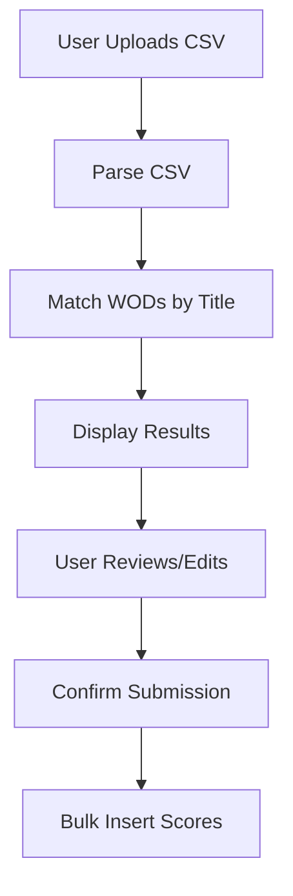

# Score Import Flow Specification

## Overview

This document outlines the complete flow for importing workout scores from CSV files through a user interface with confirmation steps.

## Flow Diagram



## Components

### 1. CSV Upload Component

- Accepts .csv files via drag-and-drop or file selection
- Validates file format and structure
- Shows parsing progress
- Displays immediate error feedback

### 2. Processing Stage

- Client-side CSV parsing (papaparse)
- WOD matching logic:
  ```typescript
  interface ProcessedRow {
    csvRow: CsvRow;
    matchedWod: Wod | null;
    matchConfidence: number;
    validationErrors: string[];
    selected: boolean;
  }
  ```

### 3. Review Table Component

Features:

- Sortable columns (Date, WOD Name, Score, RX Status)
- Filterable by match status
- Bulk selection controls
- Inline editing for corrections
- Visual indicators for:
  - Successful matches
  - Unmatched WODs
  - Validation warnings

### 4. Confirmation Dialog

Displays:

- Total records processed
- Matched count
- Unmatched count
- Validation error count
- Summary of changes to be made

## Backend Requirements

### New TRPC Procedures

1. `score.bulkCreate`

   ```typescript
   input: {
     scores: Array<{
       wodId: string;
       time_seconds?: number;
       reps?: number;
       // ... other score fields
     }>;
   }
   ```

2. `wod.searchByTitle` (enhance existing)
   ```typescript
   input: {
     title: string;
     exactMatch: boolean;
   }
   ```

## Data Structures

### CSV Row Format

```typescript
interface CsvRow {
  date: string; // mm/dd/yyyy
  title: string;
  description: string;
  best_result_raw: string;
  best_result_display: string;
  score_type: "time" | "reps" | "load" | "rounds";
  rx_or_scaled: "RX" | "SCALED";
  notes?: string;
}
```

### Processed Row Format

```typescript
interface ProcessedRow {
  id: string;
  csvRow: CsvRow;
  matchedWod: Wod | null;
  validation: {
    isValid: boolean;
    errors: string[];
  };
  proposedScore: Omit<Score, "id" | "userId">;
}
```

## UI States

1. **Uploading**: File processing indicator
2. **Matching**: WOD lookup in progress
3. **Review**: Interactive results table
4. **Submitting**: Bulk insert progress
5. **Complete**: Success/error summary

## Error Handling

- Invalid CSV format
- Missing required columns
- Unparseable dates
- Invalid score values
- Database insertion errors

## Analytics Events

- Import started
- Records processed count
- Match success rate
- User corrections made
- Final submission result

## Security Considerations

- File size limits (10MB)
- CSV sanitization
- Rate limiting
- User ownership validation
