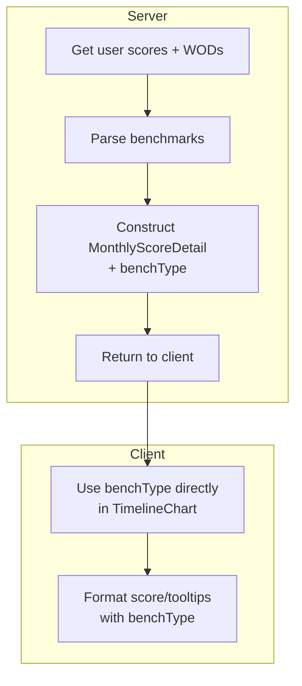

# Plan: Pass Benchmark Type from Server for Timeline Chart Data

## Overview

Currently, the client-side code for the timeline chart (e.g., `WodTimelineChart.tsx`) infers the benchmark type (`"time" | "reps" | "load" | "rounds"`) from the score object by checking which field is non-null. This approach is brittle, can lead to inconsistencies, and duplicates logic that should be centralized.

**Goal:**  
Eliminate client-side inference of benchmark type for timeline chart data. Instead, have the server explicitly provide the benchmark type for each score data point. This will make the client code simpler, more robust, and future-proof.

---

## Detailed Steps

### 1. Server-Side Changes

#### a. Identify Data Construction Location

- Locate the server-side code (API route, controller, or data loader) that constructs the timeline chart data, specifically the array of `MonthlyScoreDetail` objects.
- This is likely in a file related to chart data aggregation, analytics, or user progress endpoints.

#### b. Add `benchType` Field

- When constructing each `MonthlyScoreDetail`, add a new field:
  ```ts
  benchType: Benchmarks["type"];
  ```
- The value should be set based on the WOD's benchmark type associated with the score. For example:
  ```ts
  benchType: wod.benchmarks?.type;
  ```
- Ensure that this field is always present and valid for every score in the timeline data.

#### c. Update Type Definitions

- In `src/types/wodTypes.ts`, update the `MonthlyScoreDetail` type:
  ```ts
  export type MonthlyScoreDetail = {
    wodName: string;
    level: number;
    difficulty: string | null;
    difficultyMultiplier: number;
    adjustedLevel: number;
    time_seconds: number | null;
    reps: number | null;
    load: number | null;
    rounds_completed: number | null;
    partial_reps: number | null;
    is_rx: boolean | null;
    benchType: Benchmarks["type"]; // <-- Add this line
  };
  ```

#### d. Propagate the Change

- Ensure all code paths that create or transform `MonthlyScoreDetail` objects (including tests, mocks, and any batch processing scripts) are updated to include the new `benchType` field.

---

### 2. Client-Side Refactor

#### a. Remove Inference Logic

- In `src/app/charts/components/WodTimelineChart.tsx`, remove all code that infers the benchmark type from score fields (e.g., checking which field is non-null).
- Remove the local `BenchType` type alias.

#### b. Use Server-Provided `benchType`

- Wherever the benchmark type is needed (e.g., when constructing a minimal WOD object for formatting, or for display logic), use the `benchType` field from the `MonthlyScoreDetail` object directly.

  Example:

  ```ts
  const minimalWod = {
    // ...
    benchmarks: {
      type: score.benchType,
      levels: {
        /* ... */
      },
    },
  };
  ```

#### c. Update Imports

- Import `Benchmarks` from `~/types/wodTypes` if needed for type safety.

#### d. Test the Component

- Manually test the timeline chart to ensure that scores are displayed and formatted correctly.
- Check for regressions, especially in tooltips and score breakdowns.

---

### 3. Rationale

- **Single Source of Truth:** The server is the authority on WOD structure and benchmark types. Passing this data avoids duplication and drift.
- **Robustness:** Prevents bugs where the client might infer the wrong type due to ambiguous or incomplete score data.
- **Simplicity:** Client code becomes simpler and easier to maintain.
- **Extensibility:** If benchmark types or score structures change in the future, only the server logic needs to be updated.

---

### 4. Additional Considerations

- **Backwards Compatibility:** If there are clients or consumers expecting the old structure, consider versioning the API or providing a migration path.
- **Validation:** Add type checks or runtime validation to ensure `benchType` is always present and valid.
- **Documentation:** Update any API or data contract documentation to reflect the new field.

---

## Summary Table

| Step             | Location                | Action                                                                 |
| ---------------- | ----------------------- | ---------------------------------------------------------------------- |
| Add `benchType`  | Server (API/data layer) | Set `benchType` on each `MonthlyScoreDetail` from WOD's benchmark type |
| Update type      | `wodTypes.ts`           | Add `benchType: Benchmarks['type']` to `MonthlyScoreDetail`            |
| Remove inference | Client (TimelineChart)  | Delete local inference logic and type alias                            |
| Use `benchType`  | Client (TimelineChart)  | Use `score.benchType` wherever needed                                  |
| Test             | Both                    | Verify correct display and no regressions                              |

---

## Next Steps

1. Implement the server-side change to include `benchType` in all timeline chart data.
2. Update type definitions and propagate the change.
3. Refactor the client to use the new field.
4. Test thoroughly and update documentation as needed.

---

## Implementation Plan (Detailed)

### 1. Memory Bank and Codebase Review

- **Type Definition**:

  - `MonthlyScoreDetail` is defined in `src/types/wodTypes.ts` and used throughout the timeline chart data flow.
  - It currently lacks a `benchType` field.

- **Server Construction**:

  - Timeline chart data is constructed in `src/server/api/routers/wodChartHelpers.ts`, specifically in the `calculateMonthlyData` function.
  - The WOD's `benchmarks` object is already parsed for each score, so `benchmarks?.type` is available for use.

- **Client Usage**:

  - `src/app/charts/components/WodTimelineChart.tsx` currently infers the benchmark type from score fields (brittle logic).
  - The client defines its own `MonthlyScoreDetail` type (should be replaced with the shared type from `wodTypes.ts`).
  - The inferred type is used to construct a minimal WOD object for formatting in the tooltip.

- **Other Usages**:
  - `MonthlyScoreDetail` is also referenced in `src/app/charts/page.tsx` (likely for data wiring).
  - No evidence of complex test/mocks usage, but all usages are now mapped.

---

### 2. Step-by-Step Implementation Plan

#### **A. Update Type Definitions**

- In `src/types/wodTypes.ts`, add:
  ```ts
  benchType: Benchmarks["type"];
  ```
  to the `MonthlyScoreDetail` type.
- Update all type usages in the codebase to expect this new field.

#### **B. Server-Side Changes**

- In `src/server/api/routers/wodChartHelpers.ts`:
  - In `calculateMonthlyData`, when constructing each `MonthlyScoreDetail`, add:
    ```ts
    benchType: benchmarks?.type;
    ```
    Ensure this is always present and valid (add validation/logging if not).
  - Update any related helpers or batch scripts if they construct `MonthlyScoreDetail`.

#### **C. Client-Side Refactor**

- In `src/app/charts/components/WodTimelineChart.tsx`:

  - Remove all logic that infers the benchmark type from score fields.
  - Use the `benchType` field from each score directly when constructing the minimal WOD object for formatting.
  - Replace the local `MonthlyScoreDetail` type with the shared import from `~/types/wodTypes`.
  - Import `Benchmarks` from `~/types/wodTypes` for type safety if needed.

- In `src/app/charts/page.tsx`:
  - Update imports and usages to expect the new `benchType` field.

#### **D. Propagation and Validation**

- Ensure all code paths that create or transform `MonthlyScoreDetail` (including any tests, mocks, or batch scripts) are updated to include the new field.
- Add runtime validation or type checks if needed to guarantee `benchType` is always present and valid.

#### **E. Testing**

- Manually test the timeline chart to ensure scores are displayed and formatted correctly.
- Check for regressions, especially in tooltips and score breakdowns.
- If automated tests exist, update and run them to ensure all pass.

#### **F. Documentation**

- Update any API or data contract documentation to reflect the new field.

---

### 3. Visual Summary



---

### 4. Next Steps

1. Update type definitions.
2. Update server logic to provide `benchType`.
3. Refactor client to use `benchType` and remove inference.
4. Propagate changes to all usages.
5. Test thoroughly.
6. Update documentation.

---
